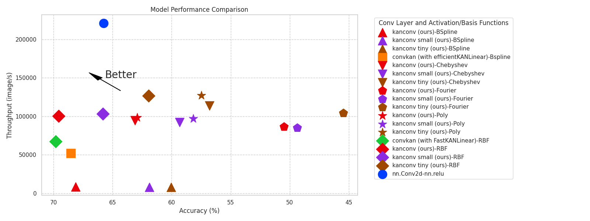
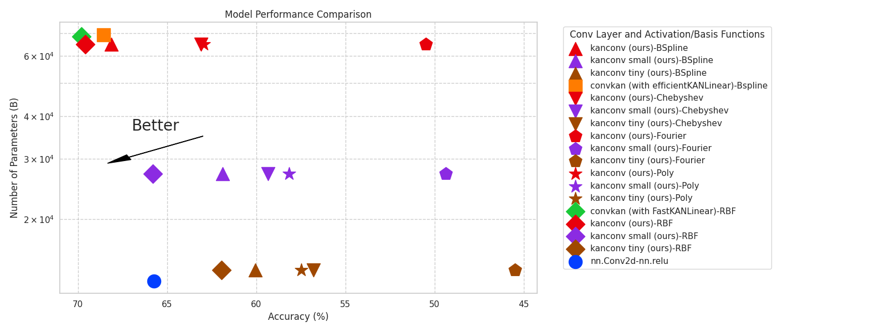

# KA-Conv: Kolmogorov-Arnold Convolutional Networks with Various Basis Functions

## Overview

The KA-Conv repository offers implementations of Kolmogorov-Arnold Convolutional Networks (KA-Conv) with different basis functions. This project aims to extend and refine the ConvKAN framework by integrating various activation functions and providing comparative performance metrics.

## Installation

### Use Pypi package

```
pip install kaconv
pip install -r requirements.txt
```

### Build from source

```
git clone https://github.com/XiangboGaoBarry/KA-Conv.git
python -m build
pip install -r requirements.txt
```

## Comparative Results

The following table presents the comparative results of different KA-Conv implementations using various activation functions. Key metrics include accuracy, parameter count, and throughput.

We compare the our results with 
- **EfficientKANLinear**: Implemented as per [EfficientKANLinear](https://github.com/Blealtan/efficient-kan)
- **FastKANLinear**: Implemented as per [FastKANLinear](https://github.com/ZiyaoLi/fast-kan.git)




<!-- results table start -->
| Conv Layer                        | Activation or Basis Function   | Hidden Layers    |   Accuracy (%) | Parameters (B)   |   Throughput (image/s) |
|:----------------------------------|:-------------|:-----------------|---------------:|:-----------------|-----------------------:|
| nn.Conv2d                         | nn.relu      | [32,32]          |          65.75 | 13,162           |                    nan |
| convkan (with efficientKANLinear) | Bspline      | [32,32]          |          68.55 | 69,332           |                    nan |
| convkan (with FastKANLinear)      | RBF          | [32,32]          |          69.8  | 68,508           |                    nan |
| kanconv (ours)                    | BSpline      | [32,32]          |         nan    | 65,076           |                    nan |
| kanconv small (ours)              | BSpline      | [8,32]           |         nan    | 27,180           |                    nan |
| kanconv tiny (ours)               | BSpline      | [8,16]           |         nan    | 14,156           |                    nan |
| kanconv (ours)                    | Chebyshev    | [32,32]          |          63.09 | 65,076           |                    nan |
| kanconv small (ours)              | Chebyshev    | [8,32]           |          59.33 | 27,180           |                    nan |
| kanconv tiny (ours)               | Chebyshev    | [8,16]           |          56.79 | 14,156           |                    nan |
| kanconv (ours)                    | Fourier      | [32,32]          |          50.5  | 65,076           |                    nan |
| kanconv small (ours)              | Fourier      | [8,32]           |          49.38 | 27,180           |                    nan |
| kanconv tiny (ours)               | Fourier      | [8,16]           |          45.48 | 14,156           |                    nan |
| kanconv (ours)                    | Poly         | [32,32]          |          62.93 | 65,076           |                    nan |
| kanconv small (ours)              | Poly         | [8,32]           |          58.17 | 27,180           |                    nan |
| kanconv tiny (ours)               | Poly         | [8,16]           |          57.48 | 14,156           |                    nan |
| kanconv (ours)                    | RBF          | [32,32]          |          69.58 | 65,076           |                    nan |
| kanconv small (ours)              | RBF          | [8,32]           |          65.81 | 27,180           |                    nan |
| kanconv tiny (ours)               | RBF          | [8,16]           |          61.95 | 14,156           |                    nan |
<!-- results table end -->

## Result Analysis

### Performance

Currently, with the same hidden layer setups, KANConv with RBF and BSpline activations outperform the original nn.Conv2d. However, KANConv also adds extra complexity, leading to more parameters and lower throughput. When reducing the number of parameters of the model to the same level as that of the model implemented with nn.Conv2d, the performance of the model implemented with KANConv is lower.

### Efficiency

TODO

## Upcoming Release

We are comparing the performance of the model on larger datasets and larger models, such as ResNet on ImageNet. The results will be released soon.

## Acknowledgements

This model is built upon [FastKAN](https://github.com/ZiyaoLi/fast-kan.git). We extend our gratitude to the creators of the original [KAN](https://github.com/KindXiaoming/pykan) for their pioneering work in this field.

